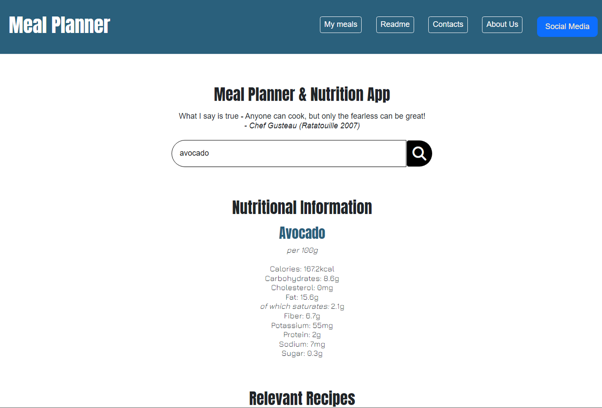
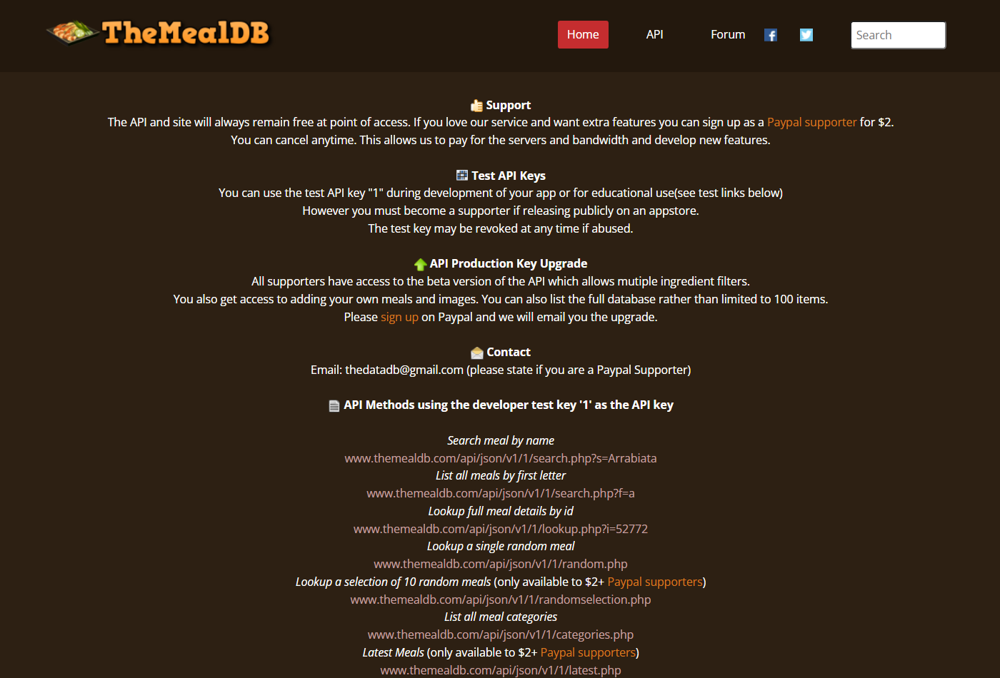
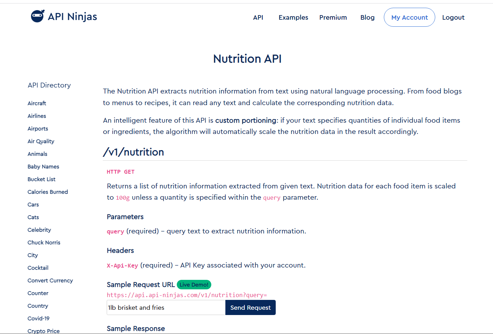

# Meal Planner Nutrition App (Trilogy Skills Bootcamp: Week 09 - Project Day)

## Table of Contents
Design Prompt:
* [Description](#Description)
* [Acceptance Criteria](#Acceptance-Criteria)
* [Concept](#Concept)

Students:
* [Cutler, Daley](#Cutler-Daley) HTML, CSS, Bootstrap
* [Hakami, Elias](#Hakami-Elias) Recipes API (themealdb)
* [Heseltine, David](#Heseltine-David) Nutrition API (api-ninjas)
* [Macie, Dercio](#Macie-Dercio) HTML, CSS, Bootstrap

Deployment:
* [URL](#URL)
* [Screenshots of the deployed application](#Screenshots-of-the-deployed-application)
* [License](#license)

</br>

___
# Design Prompt
## Description
As a team, we conceived and executed a design that solves a real-world problem by integrating data received from multiple server-side API requests. We also continued to learn about agile development methodologies to help us work collaboratively. We implemented feature and bug fixes using git branch workflow and pull requests.

We have written our own user stories and acceptance criteria in GitHub Issues to help us as a team to stay on track with the project. Using GitHub Project as a means to track the status of our project tasks helped us to understand the benefits of Kanban boards.<a href="#references">*[1]*</a>

</br>

## Acceptance Criteria

Your project must fulfil the following requirements:
* Use Bootstrap.
* Be deployed to GitHub Pages.
* Be interactive (i.e. accept and respond to user input).
* Use at least two [server-side APIs](https://coding-boot-camp.github.io/full-stack/apis/api-resources).
* Does not use alerts, confirms, or prompts (use modals).
* Use client-side storage to store persistent data.
* Be responsive.
* Have a polished UI.
* Have a clean repository that meets quality coding standards (file structure, naming conventions, follows best practices for class/id naming conventions, indentation, quality comments, etc.).
* Have a quality README (with unique name, description, technologies used, screenshot, and link to deployed application).<a href="#references">*[2]*</a>

</br>

## Concept
* Website that allows a user to search for meal ideas using just a single ingredient.
* Program for turning this user input into database searches for both meal recipes and ingredient nutritional values, from two separate APIs.
* Display the result to the user as a clear and easy to understand webpage.
* Allow the user to save their favourite recipes for later use.

</br>


<a href="#references">*[3]*</a>
<a href="#references">*[4]*</a>

</br>

___
# Students
## Cutler, Daley

(User Story, Description, etc)

</br>

## Hakami, Elias

(User Story, Description, etc)

</br>

## Heseltine, David
User Story:
```
AS A person who has little time to eat healthy,
I WANT to easily consult a database for nutritional information,
SO THAT I can view what is in each ingredient and make better decisions
```

With this project I was tasked with the role of establishing a connection to an API that would take a user input (being an ingredient) to interact with a database and output the nutritional information to the webpage. After assessing available APIs it became clear that there was only one that offered this information without incurring a cost, and as my goal was to make the content of this project using free software to allow it to be accessible; I selected the Nutrition API by API Ninjas (https://api-ninjas.com/api/nutrition).

</br>

<a href="#references">*[4]*</a>

</br>

The API comes with a significant limitation in that it cannot be called for the entire dataset of ingredients; and only opperates by being called with a single input string (the name of an ingredient) and responding with a single object containing the nutritional data.

The API offers 50,000 calls per month for free, which may be outside the scope of use in the project, however, I constructed a system where the response data is saved as an array of objects which works with local storage. If the ingredient has previously been called with the API then the JavaScript refers to the previously stored data instead, which significantly reduces the number of calls to the API and increases the response time of the program.

I initially set up an isolated test environment with a successful script showing no errors before integrating it into the rest of the project, mainly the HTML. The result is that when the user enters an ingredient into the search bar; a list of nutritional information for that ingredient is clearly displayed underneath.

</br>


</br>

While the current version works as originally intended, for future development I would like to add a nutrition calculator; so that the user can view the nutritional content of recipes as a whole.

</br>

## Macie, Dercio

(User Story, Description, etc)

</br>

___
# Deployment
## URL
* The URL of the deployed application: https://EliasHakimi00.github.io/Meal-Planner-Nutrition-App/
* The URL of the GitHub Repository: https://github.com/EliasHakimi00/Meal-Planner-Nutrition-App

</br>

## Screenshots of the deployed application

(img)

</br>

## License

MIT License

Copyright (c) 2023 EliasHakimi00

Permission is hereby granted, free of charge, to any person obtaining a copy
of this software and associated documentation files (the "Software"), to deal
in the Software without restriction, including without limitation the rights
to use, copy, modify, merge, publish, distribute, sublicense, and/or sell
copies of the Software, and to permit persons to whom the Software is
furnished to do so, subject to the following conditions:

The above copyright notice and this permission notice shall be included in all
copies or substantial portions of the Software.

THE SOFTWARE IS PROVIDED "AS IS", WITHOUT WARRANTY OF ANY KIND, EXPRESS OR
IMPLIED, INCLUDING BUT NOT LIMITED TO THE WARRANTIES OF MERCHANTABILITY,
FITNESS FOR A PARTICULAR PURPOSE AND NONINFRINGEMENT. IN NO EVENT SHALL THE
AUTHORS OR COPYRIGHT HOLDERS BE LIABLE FOR ANY CLAIM, DAMAGES OR OTHER
LIABILITY, WHETHER IN AN ACTION OF CONTRACT, TORT OR OTHERWISE, ARISING FROM,
OUT OF OR IN CONNECTION WITH THE SOFTWARE OR THE USE OR OTHER DEALINGS IN THE
SOFTWARE.

</br>

___
# References
1. Trilogy Skills Bootcamp (2023) *UK-VIRT-FE-PT-12-2022-U-LOLC/09-project-part-1-module/01-project-day-1-lesson/readme.md*
2. Trilogy Skills Bootcamp (2023) *UK-VIRT-FE-PT-12-2022-U-LOLC/09-project-part-1-module/01-project-day-1-lesson/challenge/README.md*
3. TheMealDB (2023) *https://www.themealdb.com/api.php*
4. API-Ninjas (2023) *https://api-ninjas.com/api/nutrition*
